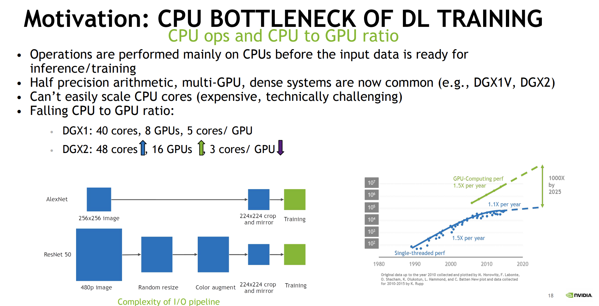
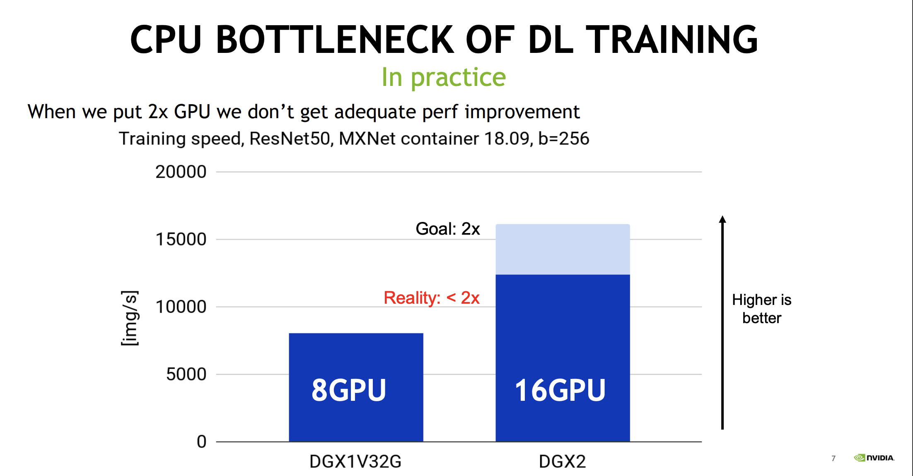
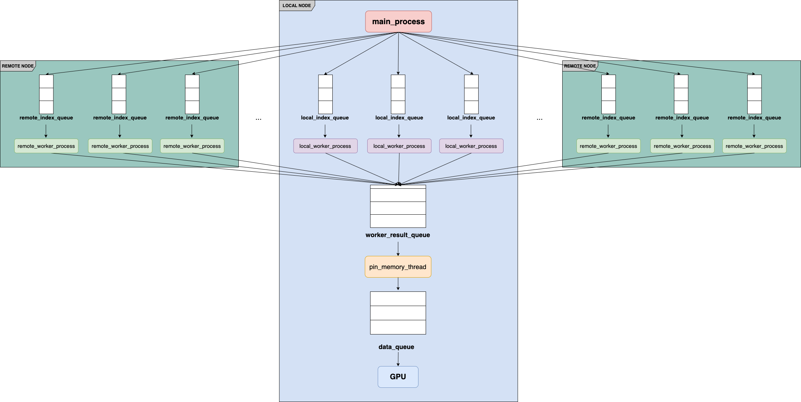

## Dpex——用户无感知分布式数据预处理组件
### 一、前言

随着GPU与CPU的算力差距越来越大以及模型训练时的预处理Pipeline变得越来越复杂，CPU部分的数据预处理已经逐渐成为了模型训练的瓶颈所在，这导致单机的GPU配置的提升并不能带来期望的线性加速。预处理性能瓶颈的本质在于每个GPU能够使用的CPU算力受限，
为了解决这个问题NVIDIA提出了scale up的方案——GPU数据预处理库[DALI](https://github.com/NVIDIA/DALI)，Tensorflow给出了scale out的方案——分布式数据预处理组件[DataService](https://github.com/tensorflow/tensorflow/tree/master/tensorflow/core/data/service),而在这里我们给出scale out的方案——分布式数据预处理库Dpex。

### 二、架构介绍（介绍Pytorch DataLoader本身的架构以及DistDataLoader的架构）
Dpex的采用了和Pytorch的DataLoader同样的架构设计并借助Ray将数据预处理任务调度至其他机器节点进行计算。

### 三、使用示例
不仅在设计上，Dpex的实现上也完全兼容Pytorch的DataLoader。当并行数据预处理时，若设置`distribute_mode`为`True`则`DpexDataLoader`使用
`_RayDataLoaderIter`实现分布式数据预处理，当设置为`False`时`DpexDataLoader`退回到使用Pytorch本身的`_MultiProcessingDataLoaderIter`
实现并行数据预处理与加载。在Pytorch训练中使用Dpex非常的简单，只需要将使用到Pytorch的`DataLoader`的地方替换为Dpex中的`DpexDataLoader`即可，当你的训练机器本身为Ray集群中的一个节点时，设置 distribute_mode=True可以启用分布式数据预处理。在下面我们给出单卡训练，使用DataParallel进行多卡训练以及使用DDP进行多卡训练时使用Dpex的示例，具体可参考测试文件。    
    class DpexDataLoader(torch.utils.data.DataLoader):
        def __init__(self, dataset: Dataset[T_co], distribute_mode: Optional[bool] = False, head_address="auto", batch_size: Optional[int] = 1,
                     shuffle: bool = False, sampler: Optional[Sampler[int]] = None,
                     batch_sampler: Optional[Sampler[Sequence[int]]] = None,
                     num_workers: int = 0, collate_fn: Optional[_collate_fn_t] = None,
                     pin_memory: bool = False, drop_last: bool = False,
                     timeout: float = 0, worker_init_fn: Optional[_worker_init_fn_t] = None,
                     multiprocessing_context=None, generator=None,
                     *, prefetch_factor: int = 2):
    

#### 3.1 单卡训练
如下我们给出单卡训练时使用DpexDataLoader的示例代码，具体代码细节参见[测试代码文件](https://github.com/eedalong/Dpex/blob/main/tests/test.py).
    
    from torchvision import datasets
    from torchvision.transforms import ToTensor
    from Dpex import dataloader
    
    training_data = datasets.FashionMNIST(
        root="data",
        train=True,
        download=True,
        transform=ToTensor()
    )
    # use DpexDataLoader
    train_loader = dataloader.DpexDataLoader(training_data, distribute_mode=True, num_workers=10, batch_size=100, shuffle=True)
    
    for epoch in range(3):
        for index, (image, label) in enumerate(train_loader):
           # your train process
           pass

#### 3.2 基于DataParallel的多卡训练
如下我们给出使用DataParallel并行训练时使用DpexDataLoader的示例代码，具体代码细节参见[测试代码文件](https://github.com/eedalong/Dpex/blob/main/tests/pytorch_data_parallel.py).

    import torch
    import torch.nn as nn
    from torch.autograd import Variable
    from torch.utils.data import Dataset
    from Dpex import dataloader
    
    class MyOwnDataset(Dataset):
         pass
         
    # use DpexDataLoader
    data_loader = dataloader.DpexDataLoader(dataset=RandomDataset(input_size, data_size),
                                            distribute_mode=True, batch_size=batch_size, shuffle=True, num_workers=10)
    
    class Model(nn.Module):
        pass
        
    model = Model()
    
    if torch.cuda.is_available():
        model.cuda()
    
    if torch.cuda.device_count() > 1:
        model = nn.DataParallel(model)
    
    for data in data_loader:
       # train your own model
       pass

#### 3.3 基于DDP的多卡训练
如下我们给出使用DDP并行训练时使用DpexDataLoader的示例代码，具体代码细节参见[测试代码文件](https://github.com/eedalong/Dpex/blob/main/tests/pytorch_ddp.py).
    
    import torch
    import torch.nn as nn
    from torch.utils.data import Dataset
    from Dpex.dataloader import DpexDataLoader
    from torch.utils.data.distributed import DistributedSampler
    
    # start command: CUDA_VISIBLE_DEVICES=1,6,7 python -m torch.distributed.launch --nproc_per_node=2 pytorch_ddp.py
    # 1) 初始化
    torch.distributed.init_process_group(backend="nccl")
    
    input_size = 5
    output_size = 2
    batch_size = 1
    data_size = 90000
    
    # 2） 配置每个进程的gpu
    local_rank = torch.distributed.get_rank()
    torch.cuda.set_device(local_rank)
    device = torch.device("cuda", local_rank)
    
    class RandomDataset(Dataset):
        def __init__(self, size, length):
            self.len = length
            self.data = torch.randn(length, size)
    
        def __getitem__(self, index):
            return self.data[index]
    
        def __len__(self):
            return self.len
    
    dataset = RandomDataset(input_size, data_size)
    # 3）使用DistributedSampler
    rand_loader = DpexDataLoader(dataset=dataset, distribute_mode=True, batch_size=batch_size, sampler=DistributedSampler(dataset), num_workers=10)
    
    class Model(nn.Module):
        def __init__(self, input_size, output_size):
            super(Model, self).__init__()
            self.fc = nn.Linear(input_size, output_size)
    
        def forward(self, input):
            output = self.fc(input)
            print("  In Model: input size", input.size(),
                  "output size", output.size())
            return output
    
    model = Model(input_size, output_size)
    
    # 4) 封装之前要把模型移到对应的gpu
    model.to(device)
    
    if torch.cuda.device_count() > 1:
        print("Let's use", torch.cuda.device_count(), "GPUs!")
        # 5) 封装
        model = torch.nn.parallel.DistributedDataParallel(model,
                                                          device_ids=[local_rank],
                                                          output_device=local_rank)
    
    for data in rand_loader:
        if torch.cuda.is_available():
            input_var = data
        else:
            input_var = data
    
        output = model(input_var)
        print("Outside: input size", input_var.size(), "output_size", output.size())
### 四、Benchmark
在接下来的Benchamark中我们核心展示两个部分的内容:
 - DpexDataLoader对于模型训练精度的影响
 - DpexDataLoader对于模型训练速度的影响 

Dpex只是将单机数据预处理水平扩展到了多机以借助更多的算力来加速数据预处理而不改变数据本身的加载和与处理方式，所以本身对模型的精度不会有负面影响。对于数据预处理较重的情况
#### 4.1 模型精度Benchmark
我们在`FashionMNIST`数据集上进行模型训练精度的Benchmark实验，具体代码细节见[测试文件](https://github.com/eedalong/Dpex/tree/main/tests)
| **Accuracy**(%) | **Loss** | **GPU Settings** | **DpexDataLoader(distributed_mode=?)** | **Epoch** | **Learning rate** | **Batch size** |
| --------------- | -------- | ---------------- | ------------------------------ | --------- | ----------------- | -------------- |
| 90.65           | 0.137    | Single GPU       | True                           | 40        | 0.001             | 100            |
| 91.09           | 0.112    | Single GPU       | False                          | 40        | 0.001             | 100            |
| 90.67           | 0.016    | DataParallel     | True                           | 40        | 0.001             | 100            |
| 90.32           | 0.008    | DataParallel     | False                          | 40        | 0.001             | 100            |
| 88.98           | 0.034    | DDP              | True                           | 40        | 0.001             | 100            |
| 89.84           | 0.030    | DDP              | False                          | 40        | 0.001             | 100            |

#### 4.2 训练速度Benchmark

### 五、环境依赖:
Dpex借助Ray完成任务的跨机调度，所以若希望使用分布式数据预处理首先需要将你的训练机器构建成Ray的集群。Ray的集群构建细节具体参考[Ray的相关文档](https://github.com/ray-project/)

